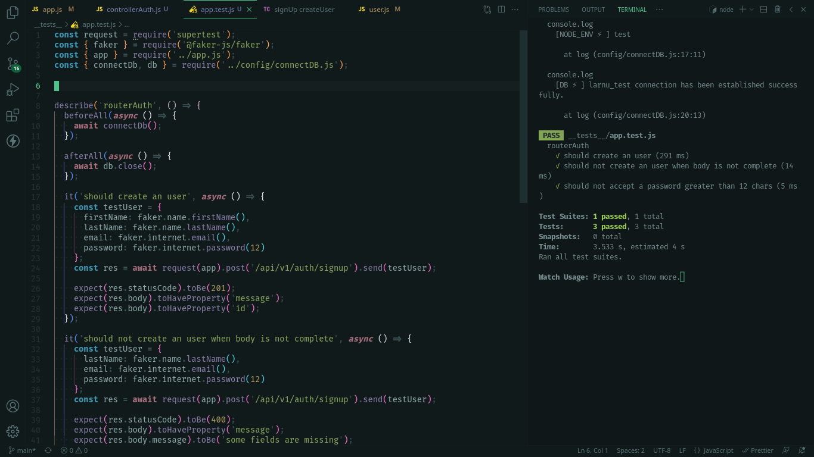
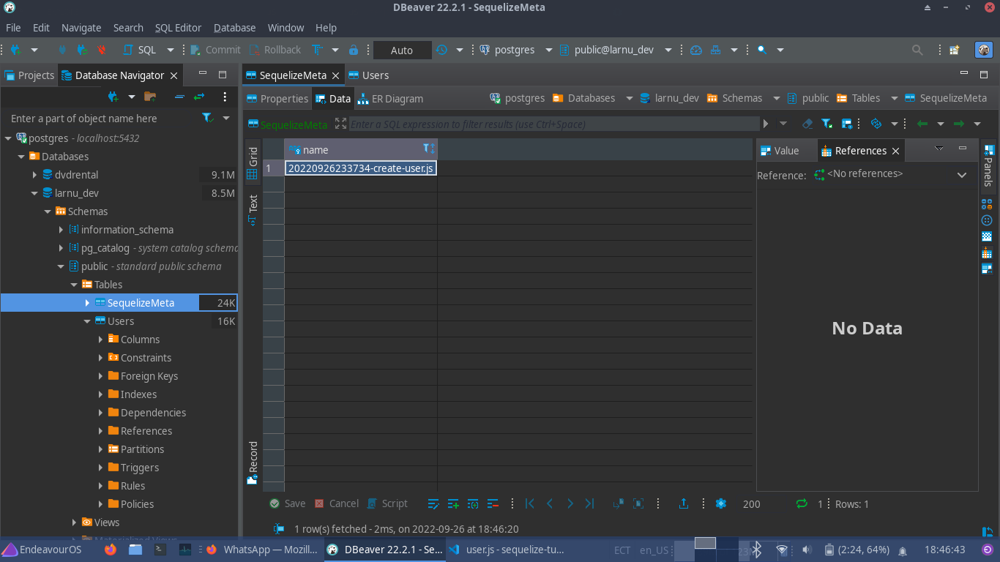

# LarnU Fullstack Bootcamp

## TODO REST API

Express, node, jest testing, supertest, github actions ci/cd postgres, sequelize and much more.

- To create, delete or update a TODO requires authentication.
- Protected endpoints.

 

## Populate .env and prod.env with your own variables environment

Like .env_sample file. Yout need 3 postgreSQL databases for development, test and production environments.

- yarn
- yarn dev
- yarn test
- yarn lint
- yarn db:reset

 

